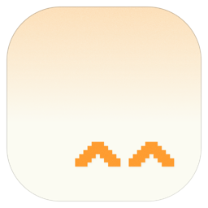

<p align="center">
  
</p>

<h1 align="center">Eyesaver</h1>

A quiet break reminder for macOS. Every 20 minutes it pulses an orange border
around your screen and slides a small dark bar up from the bottom.


## Install

```sh
git clone https://github.com/GNRNicolas/eyesaver.git && cd eyesaver && ./build.sh --install
```

That builds it, puts it in `/Applications` and starts it. Needs macOS 13+ and
the Xcode command line tools (`xcode-select --install`). No dependencies.

Eyesaver lives in the menu bar as a timer icon and the minutes left before your
next break. No Dock icon, no window.


**Skip** (`⌘esc`) dismisses everything. **Go** (`⌘return`) drops the border and
turns the bar into a countdown that disappears on its own. Either way the
interval restarts from the moment you pressed the key. Do nothing and the border
keeps pulsing, which is the point.

## Why

Most break reminders throw a full-screen overlay at you. That is effective and
infuriating. Eyesaver aims for the opposite. Impossible to miss, never in the
way:

- The border window ignores mouse events, so **clicks pass straight through**.
- The bar is a non-activating panel: **clicking it never moves focus** away from
  your editor.
- Shortcuts are registered **only while the alert is up**, so no key combination
  is held hostage while you work.


## Permissions

**None.** No Accessibility, no Input Monitoring.

That is deliberate. The obvious way to catch a global shortcut is `CGEventTap`,
which needs both, and loses the grant on every rebuild, since macOS identifies
an authorised app by its code signature. `RegisterEventHotKey` does the same job
with no permission at all and takes priority over other apps.

## Settings


| Setting | Options |
|---|---|
| Break every | 1, 10, 15, 20, 25, 30, 45, 60 min, 2 h |
| Break length | 20 s, 30 s, 1 min, 1 min 30 s, 2 min, 3 min, 5 min |
| Shortcuts | `⌘esc / ⌘return` (default), `⌃esc / ⌃space`, `⌥esc / ⌥space`, bare `esc / space` |
| Pause when idle | never, or after 1, 5, 10, 15, 30 min |
| Open at Login | via `SMAppService` |

The countdown stops while the keyboard and mouse are quiet, so a break never
waits for you while you are away from the machine.

The default pair uses `return` because `⌘space` is Spotlight. The bare preset
swallows `space` while the alert is up, which stops you finishing a sentence
before you look away.

## Breaks

A break counts once its countdown runs out; pressing Skip early does not. The
menu keeps the total and can put it on a card, to share or to **Download** into
`~/Downloads`.

During a break the bar notices if you carry on typing, and says so.

## Updates

Eyesaver checks the GitHub releases page once a day and tells you when a newer
version is out. It installs nothing: updating is `git pull && ./build.sh
--install`. One anonymous HTTPS request; nothing is sent about you. Turn it off
with **Check for Updates Automatically**.

## Forking

[FORKME.md](FORKME.md) is the guide for making this yours: what to rename, where
everything lives, and the traps that cost a debugging session.
[SPECS.md](SPECS.md) covers the architecture behind it.

## License

MIT
